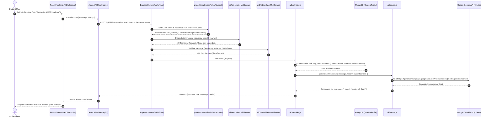

# AlumniConnect — AI Assistant Integration (Google Gemini API)

This document provides complete technical specifications for the **AlumniConnect AI Career & Learning Assistant** integrated with the **Google Gemini API**.

---

## 1. Purpose & Overview
The **AlumniConnect AI Assistant** is an intelligent career planning, technical learning, and mentorship guidance agent built directly into the student workspace. It provides student users with tailored technical roadmaps, interview preparation, project architecture suggestions, and actionable tips for networking with verified alumni mentors.

---

## 2. Architecture & Data Flow



---

## 3. Strict Security & Zero-Key-Leakage Policy

| Security Dimension | Implementation Standard |
| :--- | :--- |
| **No Frontend Key Exposure** | `GEMINI_API_KEY` is NEVER placed in `frontend/.env`, React components, or client builds. |
| **No Direct Client Calls** | Frontend never calls Google API endpoints directly. All traffic is mediated through `POST /api/ai/chat`. |
| **Role Guard** | Only authenticated users with `role: 'student'` can access `/api/ai/chat`. Alumni and Admin receive `403 Forbidden`. |
| **Safe Database Context** | Gemini never has direct database access. Only sanitized academic fields (`branch`, `semester`, `skills`, `interests`) are passed as context. Passwords, tokens, and database credentials are strictly excluded. |
| **Error Masking** | Provider stack traces, internal paths, and API keys are stripped from client error responses. |

---

## 4. Google Gemini Configuration

### Environment Variables (`backend/.env`)
```env
# Google Gemini API
GEMINI_API_KEY=your_google_gemini_api_key_here
GEMINI_MODEL=gemini-1.5-flash
```

- **Supported Models**: `gemini-1.5-flash` (recommended for fast, lightweight free-tier usage), `gemini-2.0-flash`, `gemini-1.5-pro`.
- **Generation Parameters**: `temperature: 0.7`, `maxOutputTokens: 1024`, `topP: 0.95`.

---

## 5. System Instruction & Persona

The AI operates under a system instruction configured on the server:
- **Role**: AlumniConnect AI, an AI Career and Learning Assistant for students.
- **Competencies**: Career planning, programming roadmaps, interview preparation, project ideas, mentorship readiness.
- **Platform Promotion**: Suggests students utilize platform features (Jobs board, Mentorship booking, Collaborative Projects, and Alumni search).
- **Academic Rigor**: Never fabricates alumni names, jobs, or college records.

---

## 6. Conversation History & Multi-Turn Context
- The client maintains conversation state in React state and sends the latest messages as `{ role: 'user' | 'assistant', content: '...' }`.
- The backend automatically trims history to the most recent **10 messages**, mapping roles to Gemini's `{ role: 'user' | 'model', parts: [{ text: '...' }] }` format to prevent context token overflow.

---

## 7. Route-Specific Rate Limiting
- **Middleware**: `backend/src/middleware/aiRateLimiter.js`.
- **Limit**: **10 requests per minute** per student.
- **Response upon breach**: HTTP 429 with `{ success: false, message: "You have reached the AI message rate limit (10 requests per minute). Please wait Xs before sending another question." }`.

---

## 8. Error Handling Matrix

| HTTP Status | Trigger Condition | User-Facing Message |
| :---: | :--- | :--- |
| **400** | Empty or >2000 character prompt | `"Please enter a question or message for the AI assistant"` |
| **401** | Missing or expired JWT token | `"Authentication required. Please log in again."` |
| **403** | Non-student user role (Alumni/Admin) | `"Forbidden: User role is not authorized to access this resource"` |
| **429** | Student exceeded 10 req/min limit | `"You have reached the AI message rate limit. Please wait Xs..."` |
| **429** | Gemini upstream quota limit | `"AI usage quota exceeded. Please try again in a few moments."` |
| **502** | Gemini connection timeout or network glitch | `"The AI Assistant is currently experiencing connection issues. Please try again."` |
| **503** | `GEMINI_API_KEY` not configured on server | `"Gemini API key is not configured on the server. Please set GEMINI_API_KEY in backend/.env"` |

---

## 9. Future Platform-Aware AI Extensions
The `aiService.js` architecture is structured to support future platform-aware features:
1. **AI Job Analysis & Match Scoring**: Matching student skills against alumni job requirements.
2. **AI Resume Suggestions**: Automated recommendations to improve student resume PDFs.
3. **AI Mentor Recommendation**: Semantic matching of student career interests to verified alumni profiles.
4. **AI Skill Gap Analysis**: Identifying missing competencies required for target internships.
