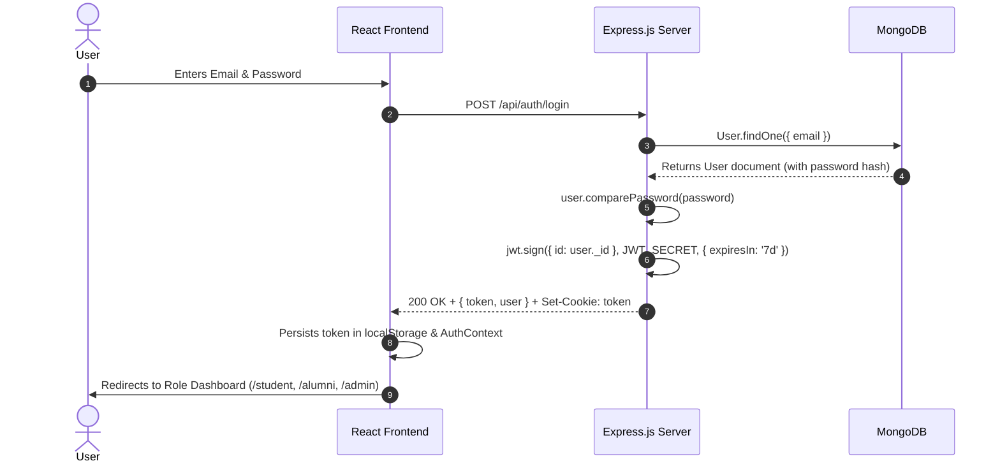
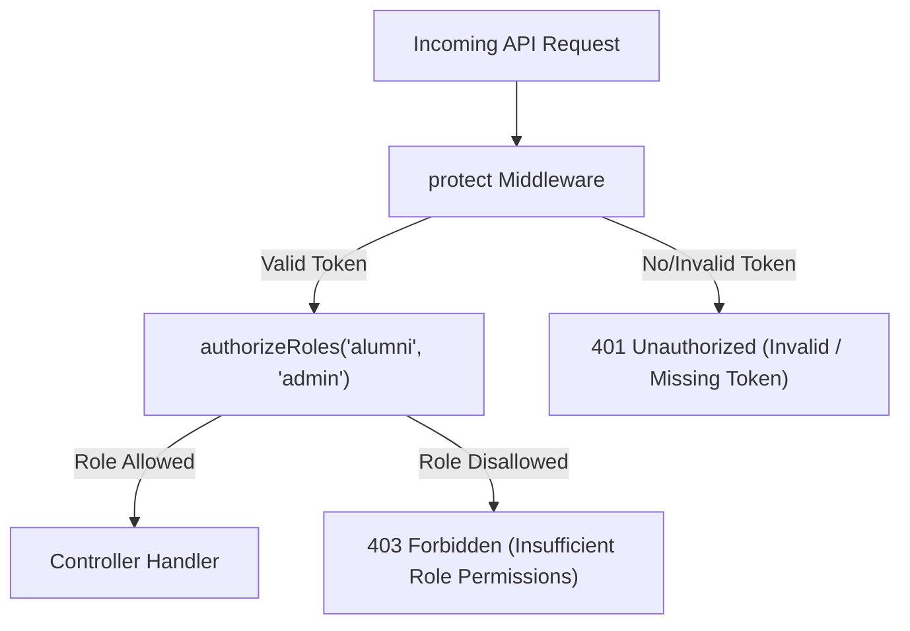
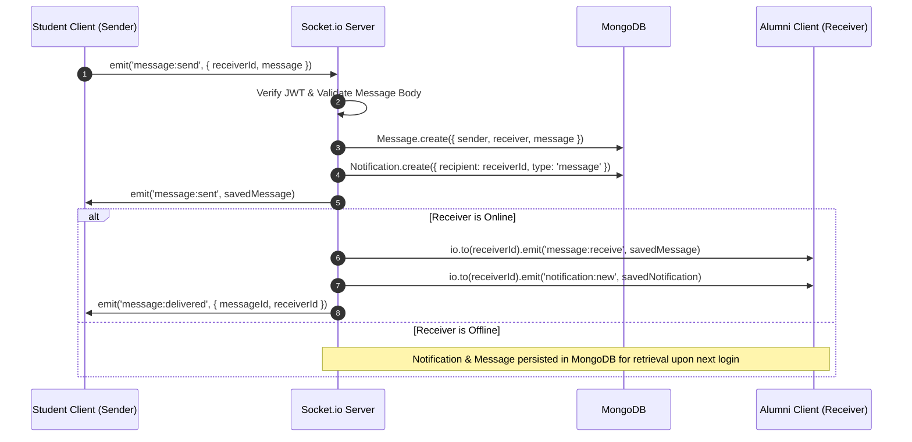

# AlumniConnect — System Architecture

AlumniConnect utilizes a modern **N-Tier Client-Server Architecture** constructed with the **MERN** stack (**MongoDB, Express.js, React.js, Node.js**) augmented with bidirectional event-driven **Socket.io** channels.

---

## 1. High-Level Architecture Diagram

```mermaid
graph TD
    Client["Browser / Client (React.js + Tailwind CSS)"]
    
    subgraph Frontend Layer
        Router["React Router v6"]
        AuthContext["AuthContext (JWT State)"]
        Axios["Axios API Client (Interceptors)"]
        SocketClient["Socket.io Client (Single Connection)"]
    end
    
    subgraph Transport & Network Layer
        HTTP["HTTPS / REST API Requests"]
        WSS["WSS / WebSockets (Real-time Events)"]
    end
    
    subgraph Backend Layer (Node.js & Express.js)
        SecurityMW["Security Middleware (Helmet, CORS, CookieParser)"]
        AuthMW["Auth Middleware (protect, authorizeRoles)"]
        Validators["Input Validation (express-validator)"]
        Controllers["Controller Layer (Business Logic)"]
        SocketServer["Socket.io Server Engine (socketServer.js)"]
    end
    
    subgraph Data & Storage Layer
        Mongoose["Mongoose ODM"]
        MongoDB[("MongoDB Database (13 Collections)")]
        LocalUploads["Multer Storage (/src/uploads)"]
    end

    Client --> Router
    Router --> AuthContext
    AuthContext --> Axios
    AuthContext --> SocketClient
    
    Axios -->|JSON over HTTP| HTTP
    SocketClient -->|Bidirectional Frames| WSS
    
    HTTP --> SecurityMW
    WSS --> SocketServer
    
    SecurityMW --> AuthMW
    AuthMW --> Validators
    Validators --> Controllers
    Controllers --> Mongoose
    SocketServer --> Mongoose
    
    Controllers -->|Multipart/Form-Data| LocalUploads
    Mongoose --> MongoDB
```

---

## 2. Layer-by-Layer Technical Breakdown

### A. Presentation Layer (React Frontend)
- **Framework**: React.js 18.3+ built with Vite 5.x.
- **Styling**: Tailwind CSS 3.4 utility classes following a professional slate/indigo palette.
- **Routing**: React Router DOM 6.23 with declarative `ProtectedRoute` guards verifying user tokens and role hierarchies.
- **State Management**:
  - `AuthContext`: Centralized authentication provider managing JWT token persistence in `localStorage`, user session state, and automatic logout upon `401 Unauthorized` events.
  - `SocketContext`: Singleton WebSocket connection lifecycle tied to authentication state.
- **API Client**: Axios instance configured with request interceptors (attaching `Authorization: Bearer <token>`) and response interceptors (handling standardized error formatting and session eviction).

---

### B. Network & Transport Layer
- **REST Endpoints**: Stateless JSON exchanges over standard HTTP verbs (`GET`, `POST`, `PUT`, `PATCH`, `DELETE`).
- **WebSocket Protocol**: Persistent bidirectional socket connection over WebSockets with polling fallback.

---

### C. Application Layer (Node.js & Express.js Backend)
- **Runtime**: Node.js ES Modules (`"type": "module"`).
- **Web Framework**: Express.js 4.19+.
- **Middleware Pipeline**:
  1. `helmet()`: Sets secure HTTP headers (CSP, HSTS, X-Frame-Options).
  2. `cors()`: Cross-Origin Resource Sharing restricting origins to authorized client domains with credential sharing.
  3. `morgan('dev')`: HTTP request logging for development audits.
  4. `express.json()` & `express.urlencoded()`: Body parsing with size limitations.
  5. `cookieParser()`: Cookie parsing for token extraction.
  6. `protect`: JWT verification middleware that decodes token payload and attaches sanitized `req.user` to request context.
  7. `authorizeRoles(...roles)`: RBAC middleware checking `req.user.role` against endpoint whitelist.
  8. `express-validator`: Declarative request payload sanitization and schema validation.
  9. `errorHandler`: Global error handling middleware returning standardized JSON responses `{ success: false, message, errors }`.

---

### D. Real-Time Engine (Socket.io)
- **Initialization**: `http.createServer(app)` integrated with `new Server(httpServer)`.
- **Authentication**: Socket handshake middleware verifies JWT token from `auth.token` or `headers.authorization`.
- **Room Architecture**:
  - Each authenticated user automatically joins a private room named after their unique MongoDB `userId`.
  - Targeted messaging (`io.to(receiverId).emit(...)`) enables private delivery without broadcasting private conversations.
  - Broadcast channels (`socket.broadcast.emit(...)`) broadcast presence changes (`user:online`, `user:offline`).

---

### E. Data Persistence Layer (MongoDB & Mongoose)
- **Database**: MongoDB document store.
- **Object Data Modeling**: Mongoose 8.4+ schemas with strong type definitions, default values, compound indexes, pre-save hashing hooks (`bcryptjs`), and document validation.
- **Collections (13 Models)**: `users`, `studentprofiles`, `alumniprofiles`, `jobs`, `applications`, `mentorshiprequests`, `projects`, `projectapplications`, `posts`, `comments`, `messages`, `notifications`, `auditlogs`.

---

## 3. Core Architectural Mechanisms

### 1. JSON Web Token (JWT) Authentication


---

### 2. Role-Based Access Control (RBAC) Flow


---

### 3. Real-Time Messaging & Notification Architecture


---

### 4. File Upload Architecture (Resumes & Avatars)
- **Middleware**: `multer` with disk storage configured at `src/uploads/`.
- **Validation**:
  - File Type Filter: Resumes restricted to `application/pdf`; avatars restricted to `image/jpeg`, `image/png`, `image/webp`.
  - File Size Limit: Capped at 5 MB per file.
- **Handling**: Multer parses multi-part forms and saves files with sanitized UUID timestamp filenames; controller records the accessible URL in the corresponding profile document.
