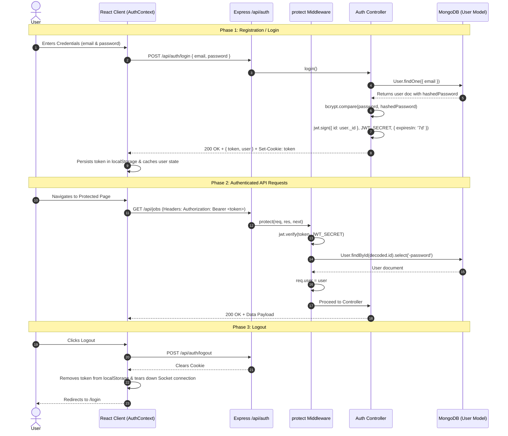

# AlumniConnect — Authentication & Authorization Architecture

AlumniConnect implements a robust, stateless **JSON Web Token (JWT)** authentication model supplemented with **HTTP-Only Cookies** and **bcryptjs** cryptographic password hashing.

---

## 1. Authentication Lifecycle Diagram



---

## 2. Password Hashing Mechanism

Password security is enforced at the database model level using **`bcryptjs`**:
1. When a user creates an account or modifies their password, Mongoose executes a `pre('save')` hook:
   ```javascript
   UserSchema.pre('save', async function (next) {
     if (!this.isModified('password')) return next();
     const salt = await bcrypt.genSalt(10);
     this.password = await bcrypt.hash(this.password, salt);
     next();
   });
   ```
2. Password verification is performed via an instance method:
   ```javascript
   UserSchema.methods.comparePassword = async function (candidatePassword) {
     return await bcrypt.compare(candidatePassword, this.password);
   };
   ```
3. Passwords are excluded from query results by default or stripped before sending API responses.

---

## 3. JWT Token Structure & Generation

Tokens are signed using the HMAC-SHA256 algorithm via `jsonwebtoken`:
- **Payload**: Contains the unique user identifier `{ id: user._id }`.
- **Secret**: Protected by `process.env.JWT_SECRET`.
- **Expiration**: Standard lifetime is 7 days (`7d`).

---

## 4. Protected Route & Role Authorization Middleware

### A. Authentication Guard (`protect` in `middleware/authMiddleware.js`)
1. Reads token from `req.headers.authorization` (as `Bearer <token>`) or `req.cookies.token`.
2. Validates token signature with `jwt.verify()`.
3. Queries database to verify user existence and check that `user.isActive === true`.
4. Attaches the clean user document to `req.user`.
5. If invalid or expired, returns `401 Unauthorized`.

### B. Role Guard (`authorizeRoles` in `middleware/roleMiddleware.js`)
Restricts endpoint access based on `req.user.role`:
```javascript
export const authorizeRoles = (...roles) => {
  return (req, res, next) => {
    if (!req.user || !roles.includes(req.user.role)) {
      return res.status(403).json({
        success: false,
        message: `Forbidden: User role '${req.user?.role}' is not authorized to access this resource`,
      });
    }
    next();
  };
};
```

---

## 5. Frontend Route Protection (`ProtectedRoute.jsx`)

The React application uses a declarative wrapper around React Router routes:
1. **Loading State**: Displays full-screen loader while `AuthContext` validates existing credentials on initial page load.
2. **Authentication Check**: If `!isAuthenticated || !user`, redirects user to `/login` preserving the attempted destination in `location.state`.
3. **Role Whitelist Check**: If `allowedRoles` is specified (e.g. `['student', 'admin']`), confirms that `user.role` is included. If unauthorized, immediately redirects to `/unauthorized` (HTTP 403 Access Denied view).
