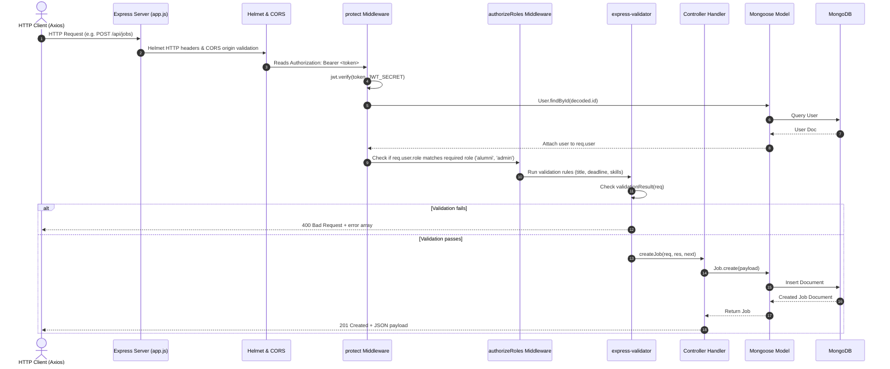

# AlumniConnect — Backend Architecture

The **AlumniConnect** backend is a modular, event-driven REST API and WebSocket engine constructed with **Node.js**, **Express.js**, and **MongoDB (Mongoose)**.

---

## 1. Directory Structure

```
backend/src/
├── config/
│   └── db.js                  # Mongoose connection management & retry logic
├── controllers/               # Business logic controllers (19 files)
│   ├── adminDashboardController.js
│   ├── adminJobController.js
│   ├── adminMentorshipController.js
│   ├── adminModerationController.js
│   ├── adminProjectController.js
│   ├── adminUserController.js
│   ├── alumniProfileController.js
│   ├── applicationController.js
│   ├── auditController.js
│   ├── authController.js
│   ├── commentController.js
│   ├── jobController.js
│   ├── mentorshipController.js
│   ├── messageController.js
│   ├── notificationController.js
│   ├── postController.js
│   ├── projectApplicationController.js
│   ├── projectController.js
│   └── studentProfileController.js
│
├── middleware/                # Express middleware pipeline (4 files)
│   ├── authMiddleware.js      # JWT token verification ('protect')
│   ├── errorMiddleware.js     # 404 'notFound' and global 'errorHandler'
│   ├── roleMiddleware.js      # Role authorization ('authorizeRoles')
│   └── uploadMiddleware.js    # Multer disk storage and file type filters
│
├── models/                    # Mongoose database schemas (13 files)
│   ├── AlumniProfile.js
│   ├── Application.js
│   ├── AuditLog.js
│   ├── Comment.js
│   ├── Job.js
│   ├── MentorshipRequest.js
│   ├── Message.js
│   ├── Notification.js
│   ├── Post.js
│   ├── Project.js
│   ├── ProjectApplication.js
│   ├── StudentProfile.js
│   └── User.js
│
├── routes/                    # API Route definitions (19 files)
│   ├── adminDashboardRoutes.js
│   ├── adminJobRoutes.js
│   ├── adminMentorshipRoutes.js
│   ├── adminModerationRoutes.js
│   ├── adminProjectRoutes.js
│   ├── adminUserRoutes.js
│   ├── alumniProfileRoutes.js
│   ├── applicationRoutes.js
│   ├── auditRoutes.js
│   ├── authRoutes.js
│   ├── commentRoutes.js
│   ├── jobRoutes.js
│   ├── mentorshipRoutes.js
│   ├── messageRoutes.js
│   ├── notificationRoutes.js
│   ├── postRoutes.js
│   ├── projectApplicationRoutes.js
│   ├── projectRoutes.js
│   └── studentProfileRoutes.js
│
├── socket/
│   └── socketServer.js        # Socket.io real-time engine, authentication & presence
│
├── utils/
│   └── generateToken.js       # JWT signing utility
│
├── validators/                # Request input validation schemas (13 files)
│   ├── adminValidator.js
│   ├── alumniProfileValidator.js
│   ├── applicationValidator.js
│   ├── authValidator.js
│   ├── commentValidator.js
│   ├── jobValidator.js
│   ├── mentorshipValidator.js
│   ├── messageValidator.js
│   ├── notificationValidator.js
│   ├── postValidator.js
│   ├── projectApplicationValidator.js
│   ├── projectValidator.js
│   └── studentProfileValidator.js
│
├── app.js                     # Express application configuration & route mounting
└── server.js                  # HTTP server & Socket.io server bootstrap entry point
```

---

## 2. Request Lifecycle Pipeline



---

## 3. Server Startup Sequence (`server.js`)

1. **Database Initialization**: `connectDB()` connects to MongoDB using Mongoose with connection pooling and event listeners.
2. **HTTP Server Creation**: `const server = http.createServer(app)` binds the configured Express application.
3. **Socket Engine Attachment**: `initSocketServer(server)` attaches Socket.io to the shared HTTP server.
4. **Port Listening**: Starts listening on `process.env.PORT || 5000`.
5. **Unhandled Rejection Trapping**: Global error listener captures uncaught promises and gracefully terminates connections before process exit.
