```mermaid
erDiagram
    USER ||--o| STUDENT_PROFILE : "has academic record"
    USER ||--o| ALUMNI_PROFILE : "has professional record"
    USER ||--o{ JOB : "posts (Alumni/Admin)"
    USER ||--o{ APPLICATION : "submits (Student)"
    JOB ||--o{ APPLICATION : "receives"
    
    USER ||--o{ MENTORSHIP_REQUEST : "requests (Student)"
    USER ||--o{ MENTORSHIP_REQUEST : "mentors (Alumni)"
    
    USER ||--o{ PROJECT : "creates (Alumni/Admin)"
    USER }o--o{ PROJECT : "joins as team member"
    PROJECT ||--o{ PROJECT_APPLICATION : "receives"
    USER ||--o{ PROJECT_APPLICATION : "submits (Student)"
    
    USER ||--o{ POST : "authors"
    USER }o--o{ POST : "likes"
    POST ||--o{ COMMENT : "contains"
    USER ||--o{ COMMENT : "authors"
    
    USER ||--o{ MESSAGE : "sends"
    USER ||--o{ MESSAGE : "receives"
    
    USER ||--o{ NOTIFICATION : "receives as recipient"
    USER ||--o{ NOTIFICATION : "triggers as sender"
    
    USER ||--o{ AUDIT_LOG : "executes (Admin)"

    USER {
        ObjectId _id PK
        string fullName
        string email UK
        string password
        string role "student | alumni | admin"
        string profilePicture
        boolean isVerified
        boolean isActive
        date createdAt
    }

    STUDENT_PROFILE {
        ObjectId _id PK
        ObjectId user FK
        string enrollmentNumber
        string branch
        number semester
        number graduationYear
        string bio
        array skills
        array interests
        string resumeUrl
        string github
        string linkedin
        string portfolio
        boolean profileCompleted
    }

    ALUMNI_PROFILE {
        ObjectId _id PK
        ObjectId user FK
        string company
        string designation
        number experienceYears
        string location
        string bio
        array skills
        string linkedin
        boolean mentorAvailable
        boolean profileCompleted
    }

    JOB {
        ObjectId _id PK
        string title
        string description
        string company
        string location
        string jobType "Full-time | Part-time | Internship"
        string salaryRange
        array requiredSkills
        date deadline
        ObjectId postedBy FK
        string status "Open | Closed"
        date createdAt
    }

    APPLICATION {
        ObjectId _id PK
        ObjectId student FK
        ObjectId job FK
        string resumeUrl
        string coverLetter
        string status "Applied | Reviewing | Shortlisted | Accepted | Rejected"
        date appliedAt
    }

    MENTORSHIP_REQUEST {
        ObjectId _id PK
        ObjectId student FK
        ObjectId mentor FK
        string topic
        string message
        date preferredDate
        string status "pending | accepted | rejected | cancelled | completed"
        string meetingLink
        date scheduledAt
        date completedAt
        string feedback
        number rating "1 to 5"
    }

    PROJECT {
        ObjectId _id PK
        string title
        string description
        ObjectId createdBy FK
        array requiredSkills
        string category
        array teamMembers "User FKs"
        number maxTeamSize
        string status "recruiting | in-progress | completed | cancelled"
        date deadline
        string repositoryUrl
        string demoUrl
        boolean isDeleted
    }

    PROJECT_APPLICATION {
        ObjectId _id PK
        ObjectId project FK
        ObjectId student FK
        string message
        array skills
        string status "pending | accepted | rejected | withdrawn"
        date createdAt
    }

    POST {
        ObjectId _id PK
        ObjectId author FK
        string content
        string image
        string visibility "public | students-only | alumni-only"
        array likes "User FKs"
        number likesCount
        number commentsCount
        array tags
        string status "active | hidden | deleted"
        date createdAt
    }

    COMMENT {
        ObjectId _id PK
        ObjectId post FK
        ObjectId author FK
        string content
        string status "active | hidden | deleted"
        date createdAt
    }

    MESSAGE {
        ObjectId _id PK
        ObjectId sender FK
        ObjectId receiver FK
        string message
        boolean isRead
        date readAt
        boolean isDeleted
        date createdAt
    }

    NOTIFICATION {
        ObjectId _id PK
        ObjectId recipient FK
        ObjectId sender FK
        string title
        string message
        string type "mentorship | job | project | message | verification"
        ObjectId relatedId
        string relatedModel
        boolean isRead
        date readAt
        date createdAt
    }

    AUDIT_LOG {
        ObjectId _id PK
        ObjectId admin FK
        string action
        string targetType
        ObjectId targetId
        string description
        string ipAddress
        object metadata
        date createdAt
    }
```

# AlumniConnect — Entity Relationship (ER) Diagram

The following Mermaid ER Diagram models the **13 collections** in the **AlumniConnect MongoDB database**. All entity relationships reflect the actual Mongoose schema models.

---

---

## Relationship Integrity Rules

1. **One-to-One Strict Profiles**:
   - `User (1) <---> (0..1) StudentProfile`: Bound by unique index on `StudentProfile.user`.
   - `User (1) <---> (0..1) AlumniProfile`: Bound by unique index on `AlumniProfile.user`.

2. **One-to-Many Direct Relations**:
   - `User (1) <---> (0..N) Job`: One alumni or admin can post multiple job opportunities.
   - `Job (1) <---> (0..N) Application`: One job receives multiple student applications.
   - `Post (1) <---> (0..N) Comment`: One community post contains multiple comments.
   - `User (1) <---> (0..N) Notification`: One user receives multiple notifications.

3. **Many-to-Many Collaborations**:
   - `User (M) <---> (N) Project`: Many students can join multiple projects; team roster is tracked via `teamMembers` ObjectId array in `Project`.
   - `User (M) <---> (N) Post (Likes)`: Multiple users like multiple posts; tracked via `likes` ObjectId array in `Post`.

4. **Unique Application Constraints**:
   - Unique compound index `{ student: 1, job: 1 }` prevents duplicate student submissions for the same job posting.
   - Unique compound index `{ student: 1, project: 1 }` prevents duplicate applications to the same project.
