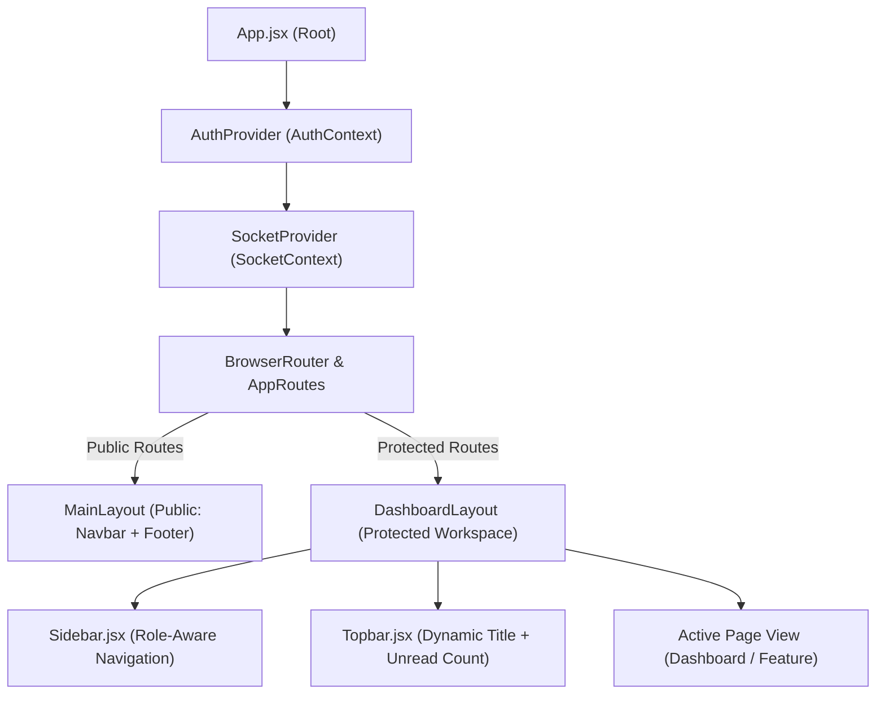

# AlumniConnect — Frontend Architecture

The **AlumniConnect** frontend is built with **React.js 18.3**, **Vite 5.x**, and **Tailwind CSS 3.4**. It follows a modular, component-driven SaaS design pattern with centralized authentication, real-time WebSocket bindings, and role-based routing.

---

## 1. Directory Structure

```
frontend/src/
├── assets/                    # Static branding and media assets
├── components/
│   ├── cards/                 # Domain-specific card components
│   │   ├── JobCard.jsx        # Job listing card with deadline, tags & apply trigger
│   │   ├── MentorCard.jsx     # Alumni card with verified badge, skills & action triggers
│   │   ├── PostCard.jsx       # Feed post with real-time like toggle & comment drawer
│   │   ├── ProjectCard.jsx    # Collaboration project card with team counters
│   │   └── StatCard.jsx       # Metric cards with variant color themes and icons
│   │
│   ├── common/                # Core atomic UI design system
│   │   ├── Button.jsx         # Buttons with loading states, sizes & variant styling
│   │   ├── EmptyState.jsx     # Visual empty state placeholders with actionable CTAs
│   │   ├── ErrorBoundary.jsx  # React error boundary catching render crashes
│   │   ├── Input.jsx          # Form input with validation feedback and icon adornments
│   │   ├── Loader.jsx         # Loading spinners with status messages
│   │   ├── Modal.jsx          # Accessible modal dialog with backdrop & focus management
│   │   └── Pagination.jsx     # Multi-page pagination bar with ellipses & page counters
│   │
│   └── layout/                # Structural layout components
│       ├── Footer.jsx         # Marketing footer
│       ├── Navbar.jsx         # Public navigation header
│       ├── Sidebar.jsx        # Responsive dynamic role-based navigation drawer
│       └── Topbar.jsx         # Workspace header with route title & unread notifications badge
│
├── constants/
│   └── routes.js              # Route constants dictionary & role redirect utilities
│
├── context/
│   ├── AuthContext.jsx        # Authentication state, JWT persistence & login/logout handlers
│   └── SocketContext.jsx      # Socket.io connection lifecycle & live presence tracking
│
├── hooks/
│   ├── useAuth.js             # Hook to access AuthContext
│   └── useSocket.js           # Hook to access SocketContext
│
├── layouts/
│   ├── MainLayout.jsx         # Public & marketing page wrapper (Navbar + Footer)
│   └── DashboardLayout.jsx    # Protected application wrapper (Sidebar + Topbar + Main Canvas)
│
├── pages/                     # Routed page views (47 components)
│   ├── admin/                 # Control center, User management, Alumni verification, Moderation, Audit logs
│   ├── alumni/                # Alumni dashboard, Profile, My jobs, Job applicants, Mentorship requests, Projects
│   ├── auth/                  # LoginPage and RegisterPage
│   ├── chat/                  # Direct messaging interface with real-time stream
│   ├── community/             # Feed stream, post composer, threaded comments
│   ├── jobs/                  # Job listings board, job details, job creation
│   ├── mentorship/            # Mentor discovery, request submission, scheduling
│   ├── notifications/         # Notification stream with mark-as-read
│   ├── profile/               # Dynamic profile switcher
│   ├── projects/              # Collaboration board, details, join requests, creation
│   ├── student/               # Student dashboard, Profile, My applications, My mentorships
│   ├── HomePage.jsx           # Public landing page
│   ├── NotFoundPage.jsx       # 404 error page
│   └── Unauthorized.jsx       # 403 access denied page
│
├── routes/
│   ├── AppRoutes.jsx          # Central route definitions and layout pairings
│   └── ProtectedRoute.jsx     # Route guard enforcing authentication and role permissions
│
├── services/                  # Centralized Axios API integration services
│   ├── adminService.js
│   ├── alumniService.js
│   ├── api.js                 # Configured Axios instance with interceptors
│   ├── applicationService.js
│   ├── authService.js
│   ├── communityService.js
│   ├── jobService.js
│   ├── mentorshipService.js
│   ├── messageService.js
│   ├── notificationService.js
│   ├── projectService.js
│   ├── socketService.js
│   └── studentService.js
│
├── App.jsx                    # Root component wiring providers and Toast notifications
├── index.css                  # Tailwind CSS root imports and custom animations
└── main.jsx                   # Vite application entry point
```

---

## 2. Component Hierarchy & Layout System



---

## 3. Centralized API Layer (`src/services/api.js`)

All communication with the backend is mediated by a pre-configured **Axios** instance:
- **Base URL**: Set dynamically via `import.meta.env.VITE_API_URL || 'http://localhost:5000/api'`.
- **Request Interceptor**: Extracts the JWT token from `localStorage` (`alumniconnect_token`) and injects the header `Authorization: Bearer <token>`.
- **Response Interceptor**:
  - Intercepts `401 Unauthorized` responses on protected endpoints.
  - Clears invalid credentials from `localStorage`.
  - Dispatches a custom window event (`auth:unauthorized`), triggering `AuthContext` to reset user state and present a notification.
  - Unifies error formats into `{ status, message, errors }` for UI consumption.

---

## 4. Role-Based Navigation & Sidebar Logic

`Sidebar.jsx` dynamically computes navigation links based on `user.role`:
- **Student**: Shows `Dashboard`, `Profile`, `Jobs`, `Applications`, `Mentors`, `Mentorship`, `Projects`, `Community`, `Messages`, `Notifications`.
- **Alumni**: Shows `Dashboard`, `Profile`, `Jobs`, `Applications`, `Mentorship`, `Projects`, `Community`, `Messages`, `Notifications`.
- **Admin**: Shows `Dashboard`, `Users`, `Alumni Verification`, `Jobs`, `Projects`, `Moderation`, `Mentorship`, `Audit Logs`, `Notifications`.
- **Mobile Responsive Drawer**: Collapses into a full slide-over drawer with backdrop blur when viewport width is below 768px.
