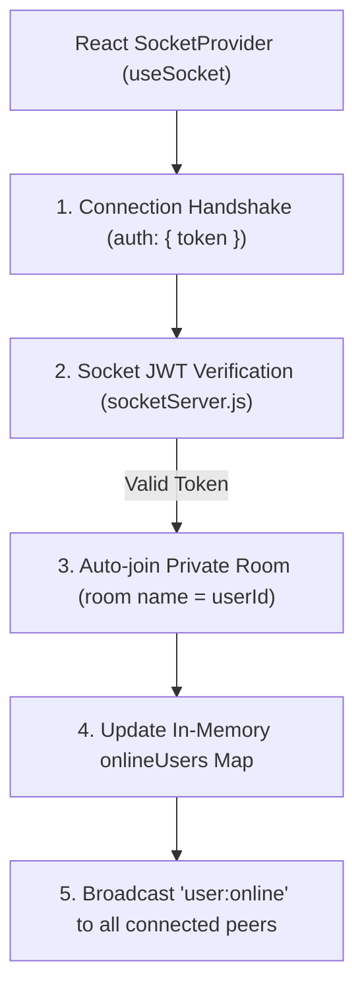
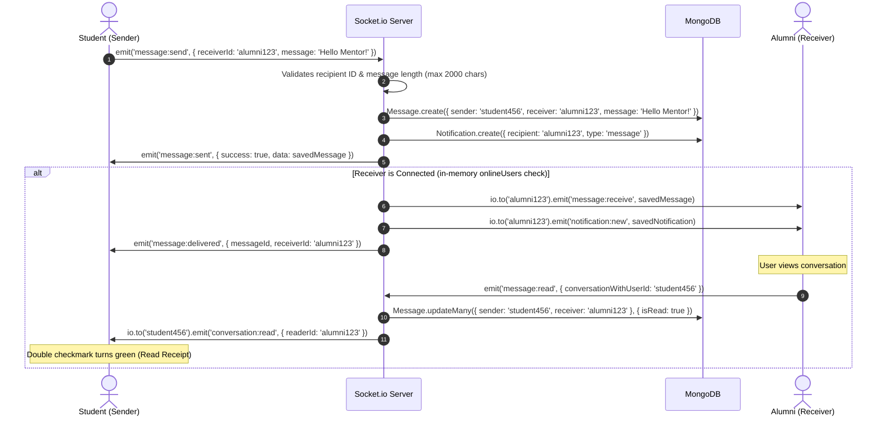

# AlumniConnect — Real-Time WebSocket Communication (Socket.io)

AlumniConnect integrates **Socket.io 4.7+** on both backend and frontend to enable real-time bidirectional messaging, presence tracking, typing indicators, and instant notifications.

---

## 1. Socket Architecture & Lifecycle

---

## 2. Implemented Socket.io Event Reference

| Event Name | Direction | Payload | Description |
| :--- | :---: | :--- | :--- |
| `connection` | Client $\rightarrow$ Server | Handshake headers / auth | Client connects and authenticates |
| `user:online_list` | Server $\rightarrow$ Client | `{ onlineUserIds: string[] }` | Sent to connecting user with all currently online IDs |
| `user:online` | Server $\rightarrow$ Client (Broadcast) | `{ userId, user, timestamp }` | Broadcasted when a user establishes active connection |
| `user:offline` | Server $\rightarrow$ Client (Broadcast) | `{ userId, timestamp }` | Broadcasted when a user disconnects their last session |
| `message:send` | Client $\rightarrow$ Server | `{ receiverId, message }` | Sender transmits new direct message |
| `message:receive` | Server $\rightarrow$ Client | Populated `Message` Document | Delivered in real-time to recipient's private room |
| `message:delivered` | Server $\rightarrow$ Client | `{ messageId, receiverId, deliveredAt }`| Confirms to sender that message reached recipient |
| `message:sent` | Server $\rightarrow$ Client | `{ success: true, data: Message }` | Confirms message saved in MongoDB |
| `message:read` | Client $\leftrightarrow$ Server | `{ messageId, conversationWithUserId }` | Acknowledges read status & delivers read receipt |
| `conversation:read`| Server $\rightarrow$ Client | `{ readerId, modifiedCount, readAt }` | Notifies partner that conversation was marked read |
| `typing:start` | Client $\rightarrow$ Server $\rightarrow$ Client| `{ receiverId }` / `{ senderId, user }`| Forwards typing indicator to active chat partner |
| `typing:stop` | Client $\rightarrow$ Server $\rightarrow$ Client| `{ receiverId }` / `{ senderId }` | Cancels typing indicator for partner |
| `notification:new`| Server $\rightarrow$ Client | Populated `Notification` Document | Dispatched to recipient for applications, mentorship & chats |
| `disconnect` | Client $\rightarrow$ Server | Disconnect reason | Cleans up socket ID from in-memory set |

---

## 3. Real-Time Message Flow Sequence

---

## 4. Connection Resilience & Cleanup

- **Singleton Pattern**: `socketService.js` prevents multiple duplicate socket instances from spawning on re-renders.
- **Automatic Reconnection**: Configured with 5 reconnection attempts and exponential backoff (`reconnectionDelay: 1000`).
- **Listener Cleanup**: React components (`Chat.jsx`, `Topbar.jsx`) detach listeners (`socket.off(...)`) during the `useEffect` unmount cleanup phase to prevent memory leaks.
