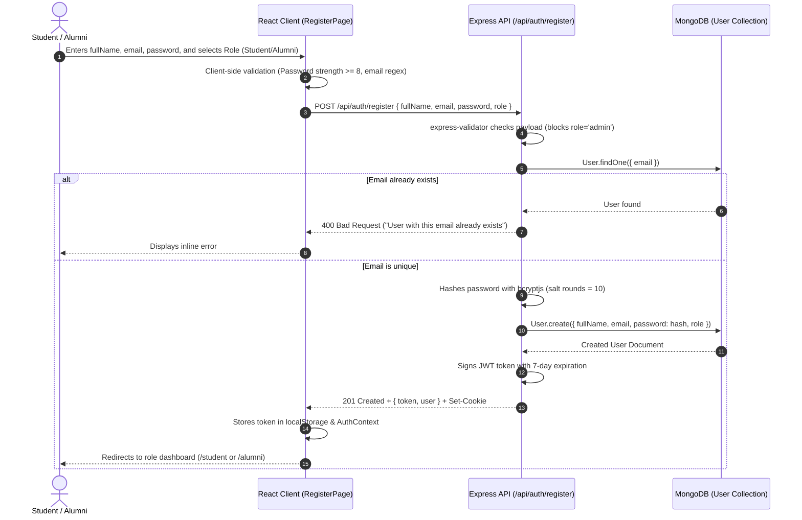
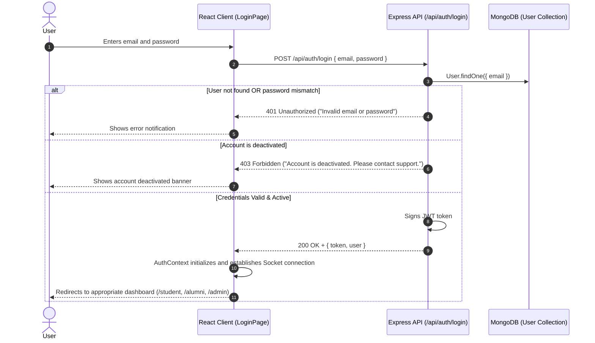
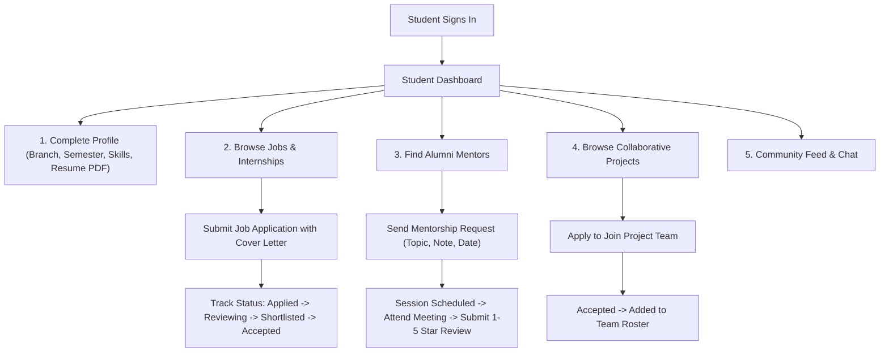
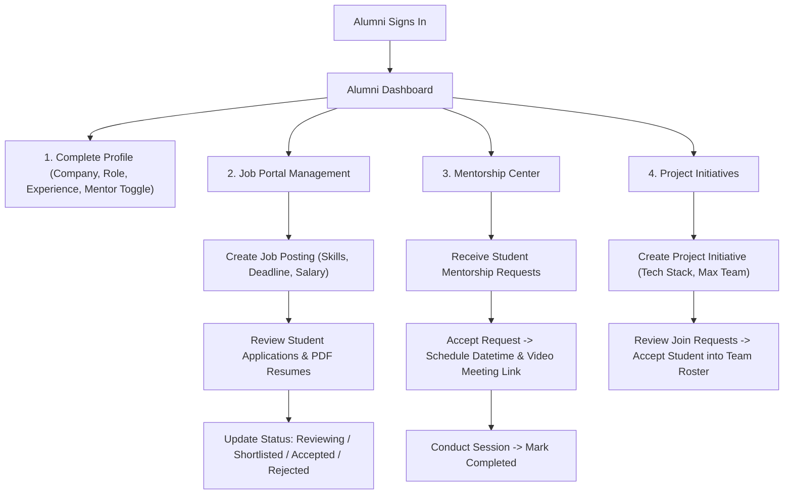
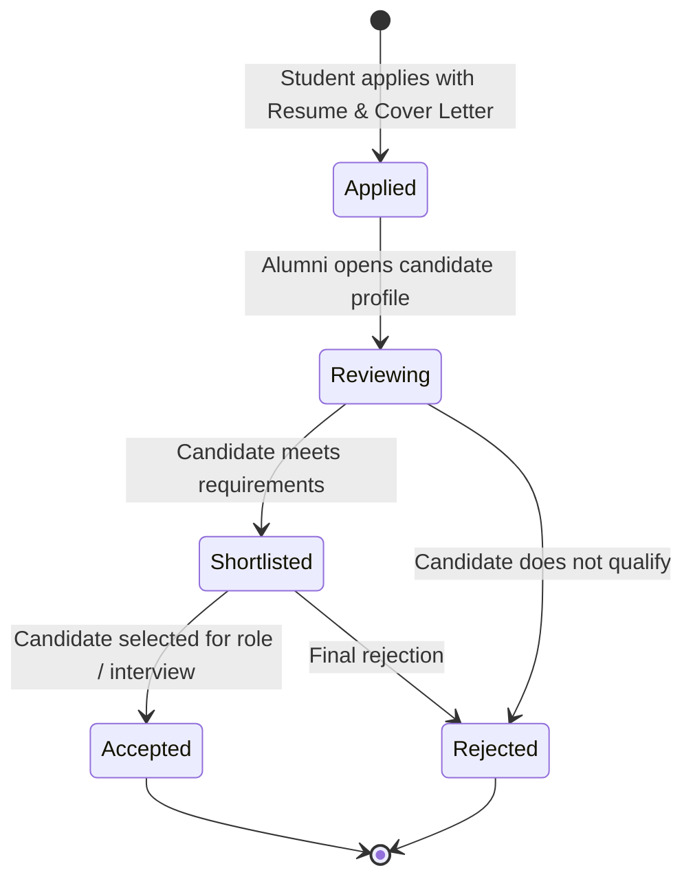
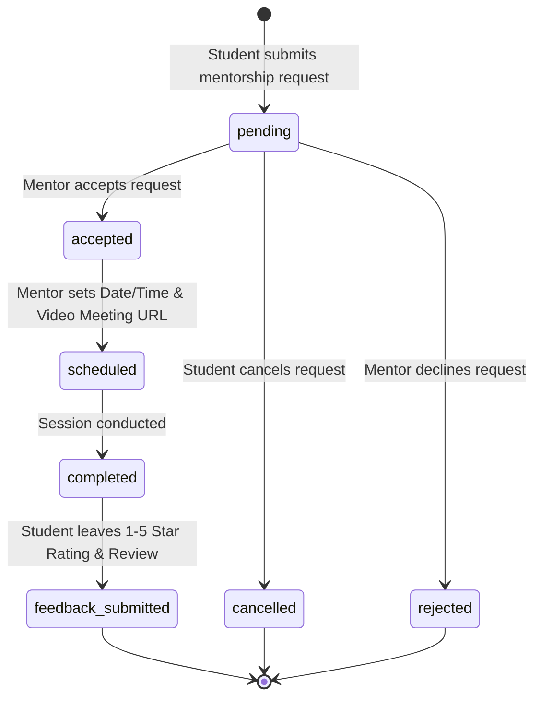
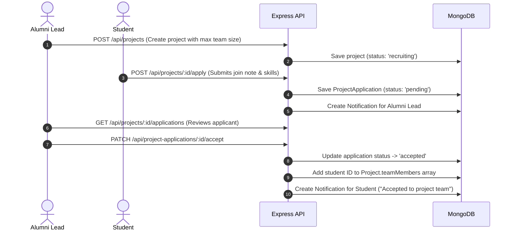
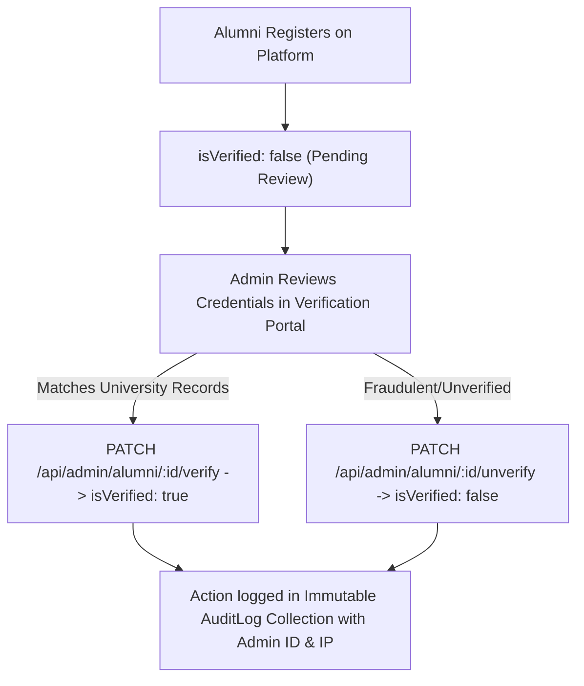

# AlumniConnect — System Flow & Workflows

This document outlines the detailed workflows across all platform capabilities in **AlumniConnect**.

---

## 1. User Registration Flow

---

## 2. Authentication & Login Flow

---

## 3. Student Workflow

---

## 4. Alumni Workflow

---

## 5. Job Application Lifecycle

---

## 6. Mentorship Request Lifecycle

---

## 7. Collaborative Project Workflow

---

## 8. Alumni Verification & Moderation Workflow (Admin)

